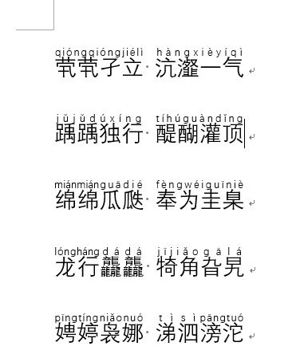
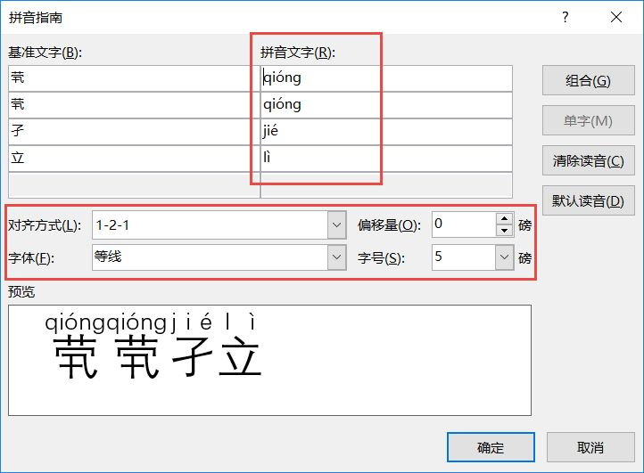

# 如何在Word文档中批量添加汉字注音

所谓的汉字注音，就是给汉字上方加注拼音。



在Office里面，这个功能叫做 **“拼音指南”（Phonetic Guide）**。



拼音指南一次只能够处理最多30个字，一篇文章不可能只有30个字，上百个字是很正常的，人工处理就会很累。所以，需要做到自动化，做到自动化有两种方式可以做到：

1. 调用Office的功能；
2. 直接修改docx文档。

## 调用Office的功能

调用Office的功能又有两个途径：

1. VBA；
2. .net。

其实，这两种途径最终都是调用的Office提供的API。

### VBA

我查过了VBA的资料，总共有3个API可用：

1. [FormatPhoneticGuide](https://learn.microsoft.com/en-us/openspecs/office_standards/ms-oi29500/1ecf33cf-3601-45f0-89fb-0ab824739343)
2. [Range.PhoneticGuide method (Word)](https://learn.microsoft.com/en-us/office/vba/api/word.range.phoneticguide)
3. [Application.GetPhonetic method (Excel)](https://learn.microsoft.com/en-us/office/vba/api/excel.application.getphonetic)

网上最多的用是第一种，使用`FormatPhoneticGuide`宏，我试过是能用的，但是存在着一个很大的问题：它不能够定制拼音的样式。而且，相对来说不够稳定。

```vba
'Word批量使用默认样式加注拼音
Sub BatchAddPinYinByDefaultStyle()
    On Error Resume Next
    Selection.WholeStory
    TextLength = Selection.Characters.Count
    Selection.EndKey
    For i = TextLength To 0 Step -30
        If i < 30 Then
            Selection.MoveLeft Unit:=wdCharacter, Count:=i
            Selection.MoveRight(Unit:=wdCharacter, Count:=i,Extend:=wdExtend)
        Else
            Selection.MoveLeft Unit:=wdCharacter, Count:=30
            Selection.MoveRight(Unit:=wdCharacter, Count:=30,Extend:=wdExtend)
        End If
        SendKeys "{Enter}"
        Application.Run "FormatPhoneticGuide"
    Next
    Selection.WholeStory
End Sub
```

另外还有一个清除注音的方法，用到了第二个API：

```vba
'Word批量清除拼音
Sub CleanPinYin()
    Application.ScreenUpdating = False
    Selection.WholeStory
    TextLength = Selection.Characters.Count
    Selection.GoTo What:=wdGoToHeading, Which:=wdGoToAbsolute, Count:=1
    For i = 0 To TextLength
        With Selection
             .Range.PhoneticGuide Text:=""
        End With
        Selection.MoveRight Unit:=wdCharacter, Count:=1
    Next
    Selection.WholeStory
    Application.ScreenUpdating = True
End Sub
```

这一个API既可以清除注音，也可以标明注音。只需要给Text赋值拼音即可。这个API好在可以定制拼音的样式，麻烦的是需要自己去计算出拼音，本来是找到了一个计算拼音的内置方法：`GetPhonetic`，但是，它只存在于Excel里面，在Word里边无法进行调用。

要实现内置的`GetPhonetic`，我在网上看到有两种实现方法：

1. 自行实现的VBA，但是实现不够完整：<https://github.com/StinkCat/CH_TO_PY>
2. 利用golang写了一个RestFull服务器提供服务，然后提供给VBA调用：<https://github.com/yangjianhua/go-pinyin>

我们来讨论第二种方法，比较灵活。

首先是golang的拼音计算服务：

```go
package main

import (
	"flag"
	"fmt"
	"strconv"

	"github.com/gin-gonic/gin"
	"github.com/mozillazg/go-pinyin"
)

var a pinyin.Args

func initPinyinArgs(arg int) { // arg should be pinyin.Tone, pinyin.Tone1, pinyin.Tone2, pinyin.Tone3, see go-pinyin doc
	a = pinyin.NewArgs()
	a.Style = arg
}

func getPinyin(c *gin.Context) {
	han := c.DefaultQuery("han", "")
	p := pinyin.Pinyin(han, a)

	c.JSON(200, gin.H{"code": 0, "data": p})
}

func getPinyinOne(c *gin.Context) {
	han := c.DefaultQuery("han", "")
	p := pinyin.Pinyin(han, a)
	s := ""

	if len(p) > 0 {
		s = p[0][0]
	}

	c.JSON(200, gin.H{"code": 0, "data": s})
}

func allowCors() gin.HandlerFunc {
	return func(c *gin.Context) {
		c.Writer.Header().Set("Access-Control-Allow-Origin", "*")
		c.Writer.Header().Set("Access-Control-Allow-Credentials", "true")
		c.Writer.Header().Set("Access-Control-Allow-Headers", "Content-Type, Content-Length, Accept-Encoding, X-CSRF-Token, Authorization, accept, origin, Cache-Control, X-Requested-With")
		c.Writer.Header().Set("Access-Control-Allow-Methods", "POST, OPTIONS, GET, PUT, DELETE")
		if c.Request.Method == "OPTIONS" {
			c.AbortWithStatus(204)
			return
		}
		c.Next()
	}
}

func main() {
	// init pinyin output format
	initPinyinArgs(pinyin.Tone)

	fmt.Print("\n\nDEFAULT PORT: 8080, USING '-port portnum' TO START ANOTHER PORT.\n\n")

	port := flag.Int("port", 8080, "Port Number, default 8080")
	flag.Parse()
	sPort := ":" + strconv.Itoa(*port)

	// using gin as a web output
	r := gin.Default()
	r.Use(allowCors())
	r.GET("/pinyin", getPinyin) // Call like GET http://localhost:8080/pinyin?han=我来了
	r.GET("/pinyin1", getPinyinOne)
	r.Run(sPort)
}
```

接着，我们来封装自己的`GetPhonetic`：

```vba
'从Json字符串中提取data字段的数据
Function getDataFromJSON(s As String) As String
    With CreateObject("VBScript.Regexp")
        .Pattern = """data"":""(.*)"""
        getDataFromJSON = .Execute(s)(0).SubMatches(0)
    End With
End Function

'使用http组件调用拼音转换服务获取拼音字符
Function GetPhonetic(strWord As String) As String
    Dim myURL As String
    Dim winHttpReq As Object

    Set winHttpReq = CreateObject("WinHttp.WinHttpRequest.5.1")

    myURL = "http://localhost:8080/pinyin1"
    myURL = myURL & "?han=" & strWord

    winHttpReq.Open "GET", myURL, False
    winHttpReq.Send

    GetPhonetic = getDataFromJSON(winHttpReq.responseText)
End Function

'测试GetPhonetic方法
Sub testGetPhonetic()
    ret = GetPhonetic("汗")
    MsgBox ret
End Sub
```

判定字符是否中文的方法：

```vba
'判断传入的Unicode是否为中文字符
Function isChinese(uniChar As Integer) As Boolean
    isChinese = uniChar >= 19968 And uniChar <= 40869
End Function
```

最后组装生成拼音注音的VBA脚本：

```vba
'Word批量拼音注音
Sub BatchAddPinYin()
    Application.ScreenUpdating = False
    Dim SelectText As String
    Dim PinYinText As String
    Selection.WholeStory
    TextLength = Selection.Characters.Count
    Selection.GoTo What:=wdGoToHeading, Which:=wdGoToAbsolute, Count:=1
    For i = 0 To TextLength
        Selection.MoveRight Unit:=wdCharacter, Count:=1
        Selection.MoveLeft Unit:=wdCharacter, Count:=1, Extend:=wdExtend
        With Selection
            SelectText = .Text'基准文字
            If isChinese(AscW(SelectText)) Then'判断是否为中文字符
                PinYinText = GetPhonetic(SelectText)'基准文字 转换为 拼音文字
                If PinYinText <> "" Then
                    .Range.PhoneticGuide _
                        Text:=PinYinText, _'拼音文本
                        Alignment:=wdPhoneticGuideAlignmentCenter, _'对齐方式
                        Raise:=0, _'偏移量（磅）
                        FontSize:=10, _'字号（磅）
                        FontName:="等线"'字体（磅）
                End If
            End If
        End With
        Selection.MoveRight Unit:=wdCharacter, Count:=1
    Next
    Selection.WholeStory
    Application.ScreenUpdating = True
End Sub
```

根据golang服务代码的提供者所说，它比较明显的缺点是对多音字的处理不如Word原来的拼音指南，所以需要后期进行手工校正。

后期校正肯定是必须的，就好比古文里边还有一些通假字，发音是不一样的，这个，我想哪怕是拼音指南也做不好的吧。

### .net

它其实也是调用的Office的API，这个跟VBA调用API没有本质上的区别，是一样的。

VS2022需要安装：**Visual Studio Tools for Office（VSTO）**

然后，在项目当中引用程序集：**Microsoft.Office.Interop.Word** ，VS2022有14和15版本。

我本机的是Office16，而vs2022并没有提供相关的程序集，所以我没有办法使用，也就没有做进一步的探索了。

我查文档在`Microsoft.Office.Interop.Word`命名空间下，有一个[Range.PhoneticGuide](https://learn.microsoft.com/en-us/dotnet/api/microsoft.office.interop.word.range.phoneticguide?view=word-pia)方法，接口看起来跟VBA调用的差不多，使用上应该也是差不太多的。

## 直接修改docx文档

docx的文档本质上是一个经过了zip压缩的[OpenXML](https://en.wikipedia.org/wiki/Office_Open_XML)文档。

基本上，主流的办公软件都支持这样一个标准：微软Office、苹果iWork、WPS Office、Google Docs。

拼音指南在Office Open XML中的类型名是：`CT_Ruby`。

Ruby，Wiki百科中解释为：注音，或称注音标识、加注音、标拼音、拼音指南。

文档可见于：

- <https://schemas.liquid-technologies.com/OfficeOpenXML/2006/?page=ct_ruby.html>
- <https://learn.microsoft.com/zh-cn/dotnet/api/documentformat.openxml.wordprocessing.rubyproperties?view=openxml-2.8.1>

我稍微研究了下，拼音指南的节点：`<w:ruby>`。

其下面有若干个子节点：

1. `<w:rubyPr>`是拼音指南的样式，
2. `<w:rt>`是拼音指南的拼音文字，
3. `<w:rubyBase>`是拼音指南的基准文字。

一个比较完整的拼音指南的XML是这样的：

```xml
<w:ruby>
    <w:rubyPr>
        <w:rubyAlign w:val="center"/>
        <w:hps w:val="26"/>
        <w:hpsRaise w:val="50"/>
        <w:hpsBaseText w:val="52"/>
        <w:lid w:val="zh-CN"/>
    </w:rubyPr>
    <w:rt>
        <w:r w:rsidR="00002ED0" w:rsidRPr="00002ED0">
            <w:rPr>
                <w:rFonts w:ascii="等线" w:eastAsia="等线" w:hAnsi="等线"/>
                <w:color w:val="333333"/>
                <w:sz w:val="26"/>
                <w:shd w:val="clear" w:color="auto" w:fill="FFFFFF"/>
            </w:rPr>
            <w:t>diǎn</w:t>
        </w:r>
    </w:rt>
    <w:rubyBase>
        <w:r w:rsidR="00002ED0">
            <w:rPr>
                <w:rFonts w:ascii="华文楷体" w:eastAsia="华文楷体" w:hAnsi="华文楷体"/>
                <w:color w:val="333333"/>
                <w:sz w:val="52"/>
                <w:shd w:val="clear" w:color="auto" w:fill="FFFFFF"/>
            </w:rPr>
            <w:t>点</w:t>
        </w:r>
    </w:rubyBase>
</w:ruby>
```

## 参考资料

- [Office_Open_XML - WikiPedia](https://en.wikipedia.org/wiki/Office_Open_XML)
- [求解MacroName:="FormatPhoneticGuide" '运行拼音指南 在vba中的初始化方法](https://club.excelhome.net/thread-1631691-1-1.html)
- [获取汉字拼音函数GetPhonetic的问题](https://club.excelhome.net/thread-859213-1-1.html)
- [有没有给大批量中文加拼音的宏？](https://club.excelhome.net/thread-1553265-1-1.html)
- [Word批量加注拼音/清除拼音](https://club.excelhome.net/thread-1520031-1-1.html)
- [Add pinyin to all text using MS word.](https://github.com/wuzhuoqing/alltextphonetic)
- [VBA实践+word快速全文加拼音](https://zhuanlan.zhihu.com/p/164457464)
